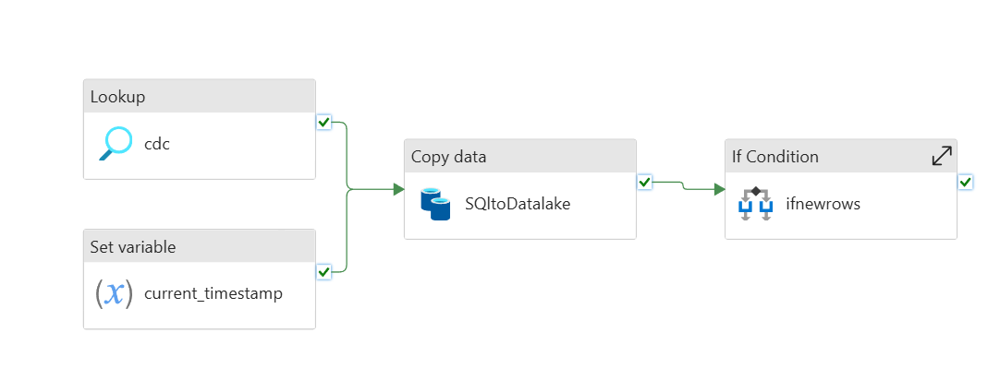
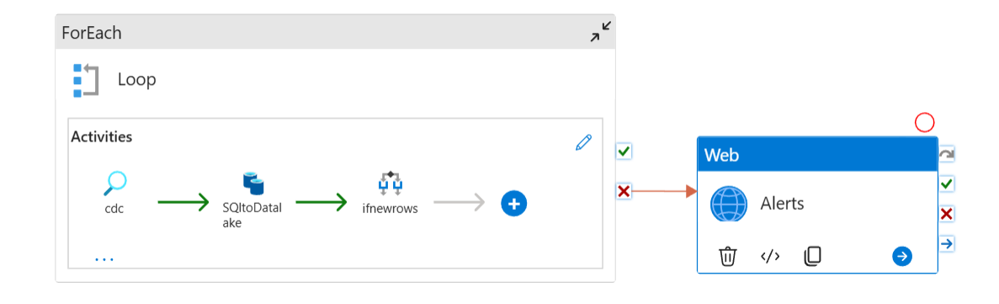
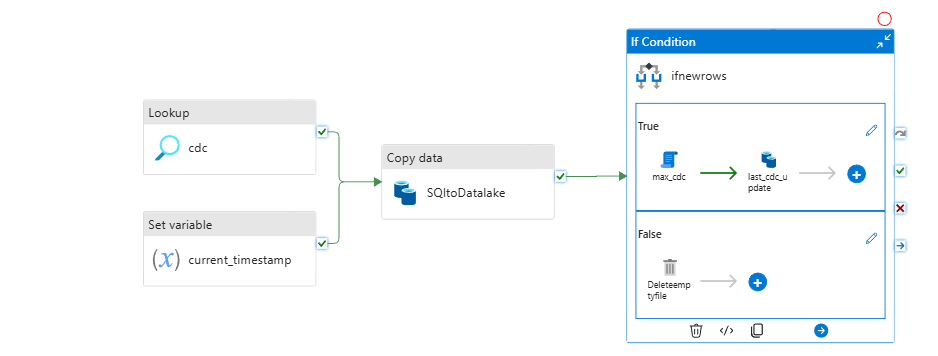
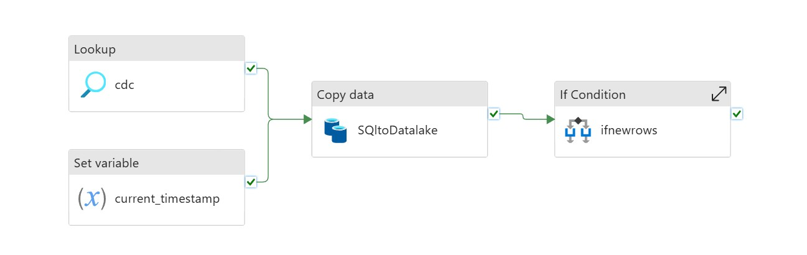

# Azure Lakehouse Platform — End-to-End Data Engineering System

This repository documents an enterprise-aligned data engineering implementation on Azure.  
The design reflects production lakehouse standards: modular ingestion, governed storage, declarative transformations, metadata-driven control, and CI/CD-based deployment of pipelines.

---

## 1. Architectural Overview

**Pattern:** Medallion Architecture (Bronze → Silver → Gold) on Delta Lake  
**Stack:** Azure SQL DB, Azure Data Factory, ADLS Gen2, Databricks (PySpark, Autoloader, DLT), Unity Catalog, Synapse, Power BI, GitHub, Key Vault, Managed Identities

**Flow**
1. Azure SQL DB → ADF → Bronze (raw, incremental, CDC-aware)  
2. Bronze → Databricks (PySpark) → Silver (cleaned, normalized, SCD-2 ready)  
3. Silver → Delta Live Tables → Gold (curated analytical models)  
4. Gold → Synapse and Power BI for consumption

The system enforces schema stability, lineage, auditability, and reproducibility across all layers.

### Architecture Diagrams

**ADF Pipeline Architecture - Overview**

**ADF Pipeline - Metadata-Driven Ingestion**

**ADF Pipeline - CDC and Incremental Load**

**ADF Pipeline - End-to-End Flow**

---

## 2. Design Principles

**Metadata-Driven Execution**  
Pipeline behavior controlled entirely through JSON configuration—no per-table branching. Enables horizontal scaling across domains without pipeline rewrites.

**Incremental + Idempotent Loads**  
ADF pipelines maintain CDC watermarks per entity. Delta Lake merge logic in Silver supports safe reprocessing and backfills.

**Governed Lakehouse**  
Unity Catalog governs all entities. Three-level namespace ensures secure, portable data access.

**Separation of Concerns**  
ADF handles data movement.  
Databricks handles compute and transformation.  
DLT handles declarative ETL and quality constraints.  
Synapse delivers warehouse querying.

**Reproducibility & Versioning**  
ADF artifacts stored as ARM templates.  
Notebooks and DLT definitions versioned in Git.  
Databricks Asset Bundles manage environment deployments.

---
## 3. Repository Structure
