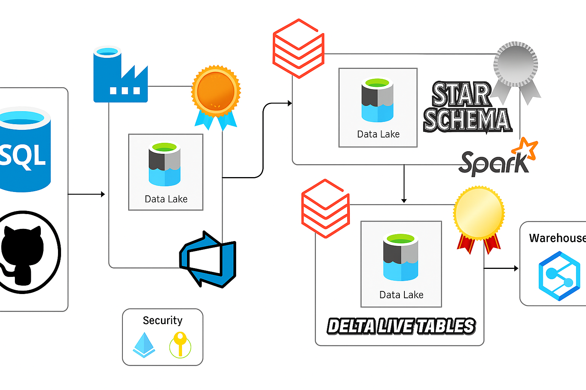

# Azure Lakehouse Platform — End-to-End Data Engineering System

This repository documents an enterprise-aligned data engineering implementation on Azure.  
The design reflects production lakehouse standards: modular ingestion, governed storage, declarative transformations, metadata-driven control, and CI/CD-based deployment of pipelines.[conversation_history:0]

---

## 1. Architectural Overview

### 1.0 Overall Project Architecture

The following diagram presents the end-to-end Azure lakehouse solution, including ingestion with ADF, storage in ADLS, transformations in Databricks and Delta Live Tables, governance via Unity Catalog, and consumption through Synapse and Power BI.[conversation_history:0]  


**Pattern:** Medallion Architecture (Bronze → Silver → Gold) on Delta Lake  
**Stack:** Azure SQL DB, Azure Data Factory, ADLS Gen2, Databricks (PySpark, Autoloader, DLT), Unity Catalog, Synapse, Power BI, GitHub, Key Vault, Managed Identities.[conversation_history:0]

**Flow**
1. Azure SQL DB → ADF → Bronze (raw, incremental, CDC-aware)  
2. Bronze → Databricks (PySpark) → Silver (cleaned, normalized, SCD-2 ready)  
3. Silver → Delta Live Tables → Gold (curated analytical models)  
4. Gold → Synapse and Power BI for consumption[conversation_history:0]

The system enforces schema stability, lineage, auditability, and reproducibility across all layers.[conversation_history:0]

### 1.1 ADF CDC + Watermark Logic

This diagram shows the CDC lookup, current timestamp variable, copy activity to Data Lake, and conditional update of CDC metadata when new rows exist.[conversation_history:0]  


### 1.2 Metadata-Driven ForEach Orchestration

This diagram illustrates the metadata-driven `ForEach` loop that executes CDC extraction, copy to Data Lake, and conditional logic per entity, followed by a web activity for operational alerts.[conversation_history:0]  


### 1.3 Incremental Copy Pipeline (Focused View)

This view focuses on the core incremental copy pipeline from CDC lookup and timestamp capture to the SQL-to-Data Lake copy and downstream conditional check for new data.[conversation_history:0]  


### 1.4 Incremental Copy Pipeline (Wide View)

This wide layout presents the same incremental pattern as a full pipeline canvas, emphasizing the end-to-end wiring between CDC lookup, variable setting, copy activity, and conditional branching.[conversation_history:0]  


---

## 2. Design Principles

**Metadata-Driven Execution**  
Pipeline behavior is controlled entirely through JSON configuration—no per-table branching—enabling horizontal scaling across domains without pipeline rewrites.[conversation_history:0]

**Incremental + Idempotent Loads**  
ADF pipelines maintain CDC watermarks per entity, while Delta Lake merge logic in Silver supports safe reprocessing and historical backfills.[conversation_history:0]

**Governed Lakehouse**  
Unity Catalog governs all entities, and a three-level namespace ensures secure, portable data access across environments.[conversation_history:0]

**Separation of Concerns**  
ADF handles data movement; Databricks handles compute and transformation; Delta Live Tables handles declarative ETL and quality constraints; Synapse delivers warehouse-style querying.[conversation_history:0]

**Reproducibility & Versioning**  
ADF artifacts are stored as ARM templates, notebooks and DLT definitions are versioned in Git, and Databricks Asset Bundles manage environment-specific deployments.[conversation_history:0]

---

## 3. Repository Structure
```
/
├── adf/
│ ├── pipelines/
│ ├── datasets/
│ ├── linked_services/
│ └── arm_templates/
│
├── databricks/
│ ├── notebooks/
│ │ ├── 01_bronze_to_silver.py
│ │ ├── 02_silver_to_gold.py
│ │ ├── 03_metadata_driver.py
│ │ └── dlt_pipeline.py
│ ├── utils/
│ │ ├── scd2_merge.py
│ │ ├── cdc_watermark.py
│ │ └── autoloader_stream.py
│ ├── bundles/
│ └── jobs/
│
├── metadata/
│ ├── table_config.json
│ └── cdc_rules.json
│
├── sql/
│ ├── create_tables.sql
│ └── seed_data.sql
│
├── assets/
│ ├── 1.png
│ ├── 2.png
│ ├── 3.png
│ └── 4.jpg
│
├── docs/
│ ├── architecture_diagram.png
│ ├── lineage.png
│ ├── data_model_star_schema.png
│ └── expectations.md
│
└── README.md
```

The repository layout separates orchestration, compute, configuration, documentation, and visual assets for clarity and maintainability.[conversation_history:0]

---

## 4. Pipeline Mechanics

### Bronze Ingestion

- ADF pipeline loops through metadata-defined entities using a `ForEach` pattern.  
- Dynamic SQL resolves schema, table, CDC column, and watermark per entity.  
- Output is written to ADLS Bronze in Delta or Parquet format.  
- Watermarks are updated atomically to preserve strict incrementality and re-runnability.[conversation_history:0]

### Silver Transformation

- Databricks notebooks enforce schema alignment, nullability rules, and core data hygiene checks.  
- Autoloader supports scalable streaming ingestion from Bronze into Silver.  
- SCD‑2 logic is implemented with reusable merge utilities, producing history-aware dimensional structures.  
- Silver tables form normalized, business-aligned datasets ready for consumption by Gold models.[conversation_history:0]

### Gold Serving

- Delta Live Tables expresses all transformations declaratively, including dependencies and expectations.  
- Data quality expectations validate constraints such as uniqueness, referential integrity, and value ranges.  
- Gold layer contains curated analytical models organized primarily as a star schema for BI tools.[conversation_history:0]

---

## 5. Data Model

### Dimensions

- dim_user  
- dim_artist  
- dim_track  
- dim_date[conversation_history:0]

### Fact

- fact_stream (grain: user × track × timestamp)[conversation_history:0]

### Gold Aggregates

- artist_agg  
- daily_stream_summary  
- user_engagement_metrics[conversation_history:0]

These entities together support user-level engagement analysis, artist performance tracking, and daily usage reporting for downstream analytics.[conversation_history:0]

---

## 6. Operational Characteristics

**Access Control**  
- Managed Identities secure Databricks-to-Storage access without embedded credentials.  
- Unity Catalog enforces fine-grained privileges and central auditing across workspaces.[conversation_history:0]

**Observability**  
- ADF run logs capture orchestration status for each ingestion entity.  
- DLT lineage graphs and quality logs expose end-to-end dependencies and rule failures.  
- Delta transaction logs provide a full audit history of changes at the table level.[conversation_history:0]

**Deployment**  
- All ADF assets, notebooks, and DLT pipelines are versioned in Git for traceability.  
- Databricks Asset Bundles manage promotion of jobs and pipelines across dev, test, and prod environments.[conversation_history:0]

---

## 7. Competencies Demonstrated

- Azure Data Factory: dynamic pipelines, CDC handling, metadata-driven orchestration.  
- Databricks: PySpark ETL, Autoloader streaming, Delta Lake optimization, SCD‑2 patterns, DLT.  
- Governance: Unity Catalog, RBAC, lineage and auditability in a lakehouse context.  
- Architecture: modern lakehouse design with Medallion layering and governed storage.  
- CI/CD: GitHub-based workflows, ARM templates, and Databricks Asset Bundles.  
- Data Modeling: dimensional/star-schema modeling for analytical workloads.  
- Analytics Integration: Synapse and Power BI for serving curated Gold data.[conversation_history:0]

---

## 8. Execution Sequence

1. Deploy Azure resources (Resource Group, ADLS Gen2, Azure SQL DB, ADF, Databricks, Unity Catalog).  
2. Load the operational schema and seed data into Azure SQL via the provided SQL scripts.  
3. Publish and validate Bronze ingestion pipelines in ADF using the metadata configuration.  
4. Run Databricks transformation notebooks to generate the Silver layer.  
5. Deploy and run Gold transformations using Delta Live Tables definitions.  
6. Expose curated Gold tables to Synapse and Power BI for reporting and dashboarding.[conversation_history:0]

---

## 9. Future Enhancements

- Integrate Great Expectations for contract-based validation at Bronze and Silver layers.  
- Enable event-driven ingestion via Event Grid or Event Hub triggers.  
- Implement Databricks cluster policies and cost governance guardrails.  
- Extend monitoring with Azure Monitor and Log Analytics for unified observability.[conversation_history:0]
